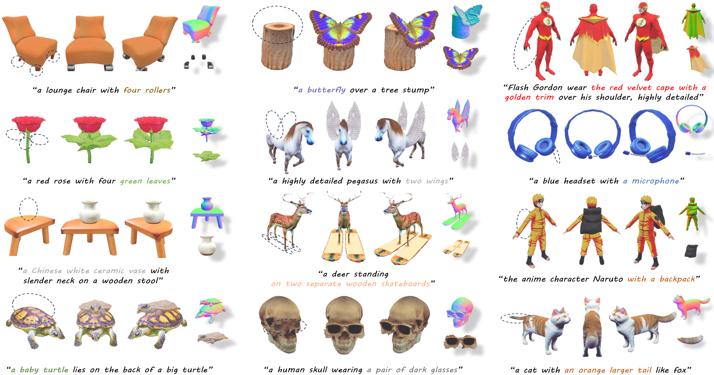
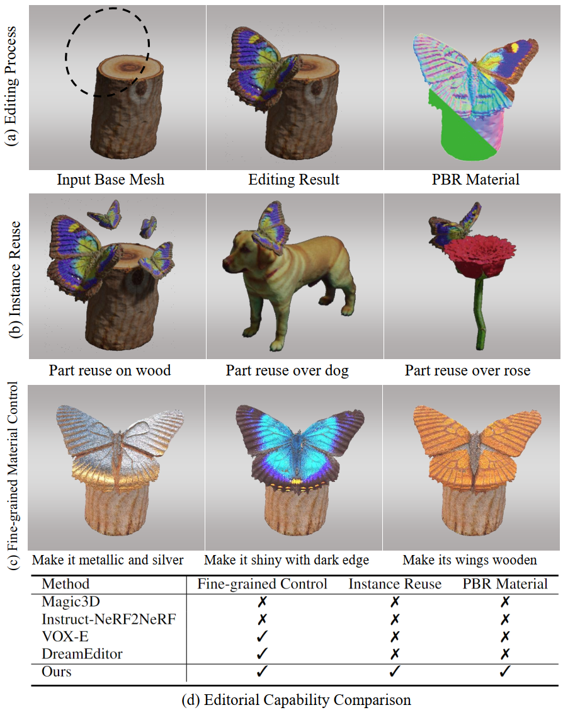
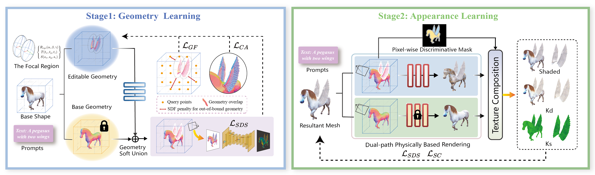

# FocalDreamer: Text-Driven 3D Editing via Focal-Fusion Assembly<br><sub><sub>Official PyTorch implementation of the AAAI 2024 paper</sub></sub>
[[`Project website`](https://focaldreamer.github.io/)]
[[`arXiv`](https://arxiv.org/abs/2308.10608)]
[[`BibTex`](#citation)]
[[`Dataset`](https://drive.google.com/file/d/1q2MGzP3ChM4wep9invkxG6bnGxmXE1fA/view?usp=sharing)]



**The codes have been released!**

# Introduction
[**FocalDreamer: Text-Driven 3D Editing via Focal-Fusion Assembly**](https://arxiv.org/abs/2308.10608)<br>
Yuhan Li, Yishun Dou, Yue Shi, Yu Lei, Xuanhong Chen, Yi Zhang, Peng Zhou, Bingbing Ni

### Abstract
*While text-3D editing has made significant strides in leveraging score distillation sampling, emerging approaches still fall short in delivering separable, precise and consistent outcomes that are vital to content creation.*

*In response, we introduce FocalDreamer, a framework that merges base shape with editable parts according to text prompts for fine-grained editing within desired regions. Specifically, equipped with geometry union and dual-path rendering, FocalDreamer assembles independent 3D parts into a complete object, tailored for convenient instance reuse and part-wise control. We propose geometric focal loss and style consistency regularization, which encourage focal fusion and congruent overall appearance. Furthermore, FocalDreamer generates high-fidelity geometry and PBR textures which are compatible with widely-used graphics engines.*

*Extensive experiments have highlighted the superior editing capabilities of FocalDreamer in both quantitative and qualitative evaluations.*

### The good properties of FocalDreamer
* **SEPARABLE**: Given a base shape, FocalDreamer produces structurally separate parts facilitating instance reuse and part-wise post-processing, grounded in widespread understanding.

* **PRECISE**: FocalDreamer also provides fine-grained and local editing, enabling precise control in the desired area, while maintaining other regions untouched.

* **CONSISTENT**: After the editing process, the resultant shape respects the characteristics of the source shape in harmonious appearance, while visually adhering to the text specifications.



### How Does it works?
As illustrated in the figure, a complete object is conceptualized as a composition of base shape and learnable parts, wherein both of them possess their own geometry and texture, tailored for convenient instance reuse and part-wise control. Instead of direct modifications to the base shape, the novel editable part is optimized in the focal region. Equipped with geometry union and dual-path rendering, this part is merged with base mesh into a semantically.

Furthermore, a two-stage training strategy is adopted to sequentially learn the geometry and texture of the editable shape inspired by Fantasia3D, to avoid the potential interference that can occur when geometry and texture learning are intertwined.

Finally, geometric focal loss and style consistency regularization are proposed to encourage focal fusion and congruent overall appearance.



# <a name="citation"></a>Citing FocalDreamer

If you find our work useful to your research, please consider citing:

```BibTeX
@misc{li2023focaldreamer,
title={FocalDreamer: Text-driven 3D Editing via Focal-fusion Assembly}, 
author={Yuhan Li and Yishun Dou and Yue Shi and Yu Lei and Xuanhong Chen and Yi Zhang and Peng Zhou and Bingbing Ni},
year={2023},
eprint={2308.10608},
archivePrefix={arXiv},
 primaryClass={cs.CV}}
```
